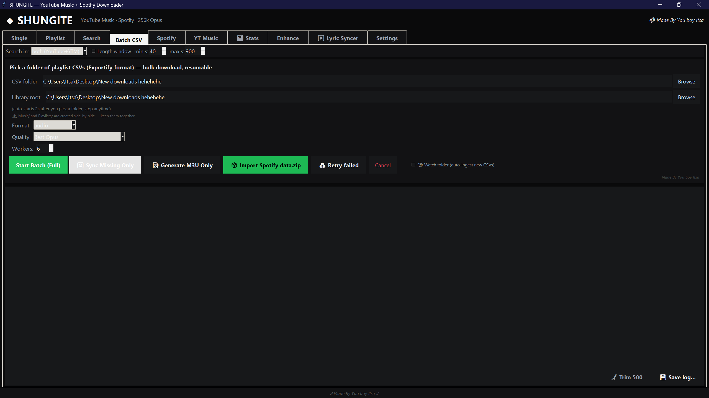
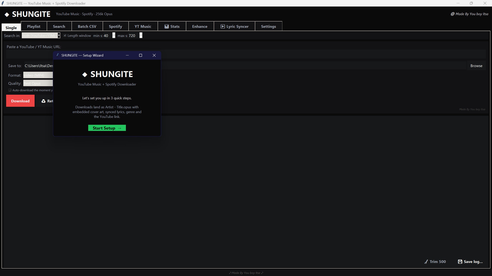
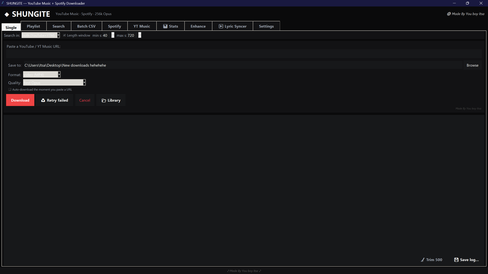
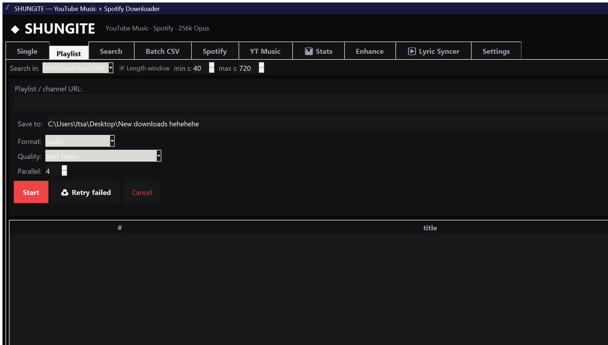
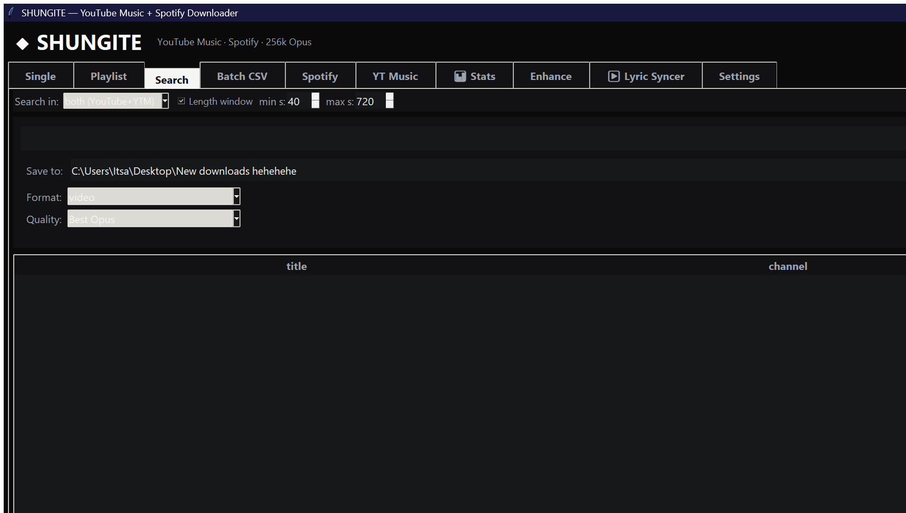
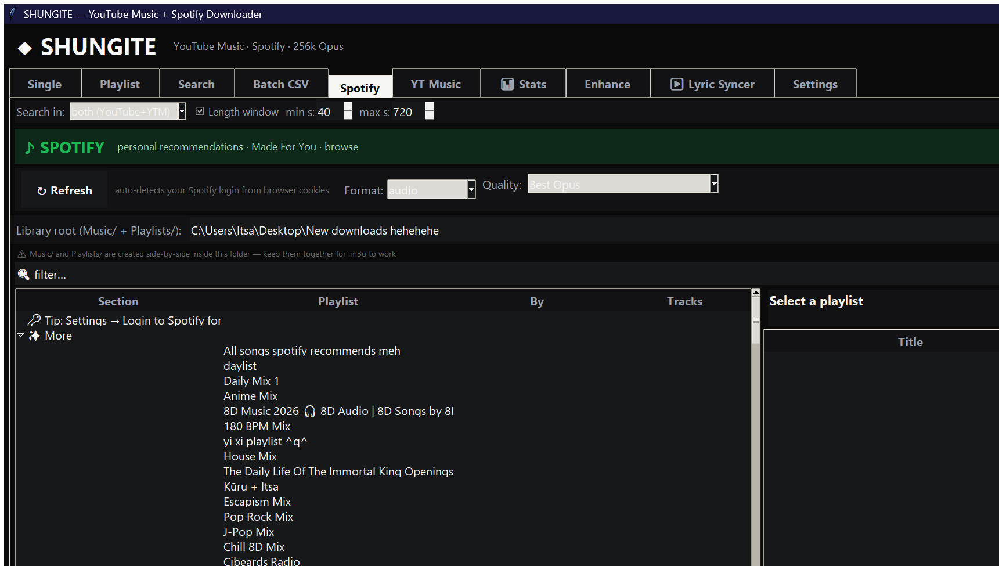
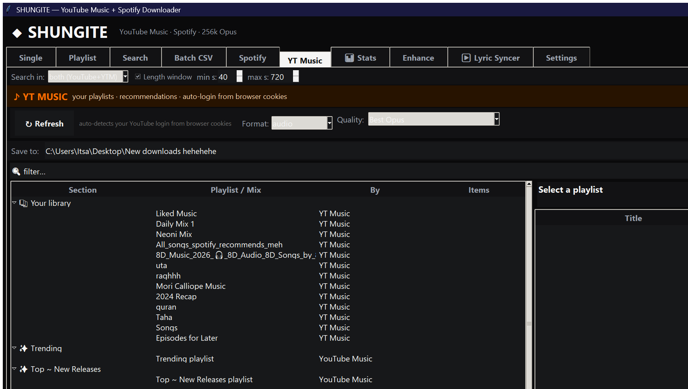
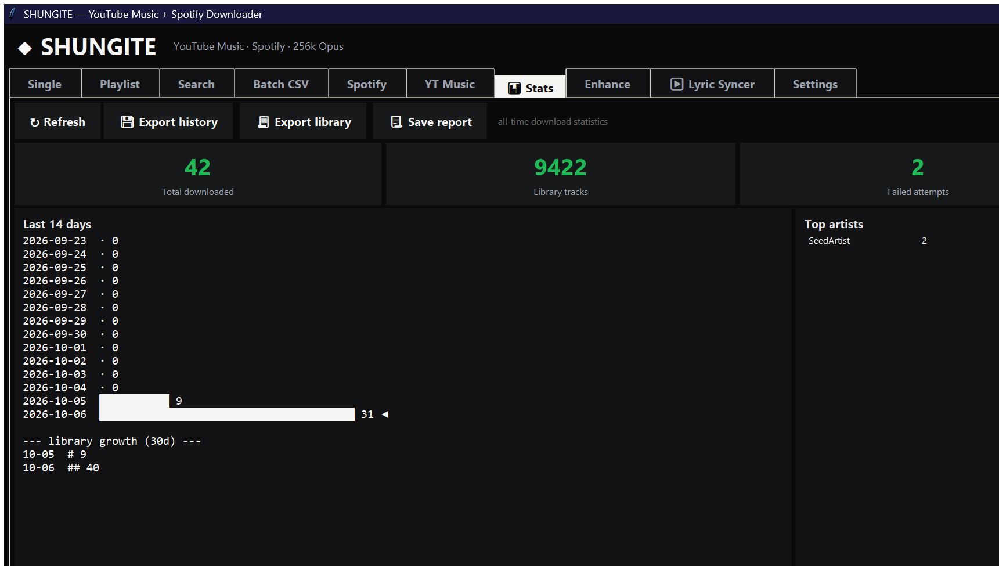
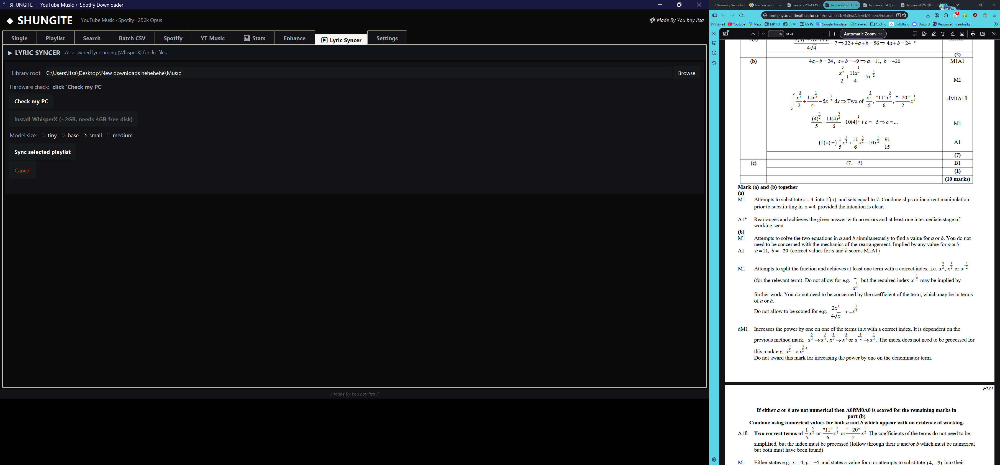
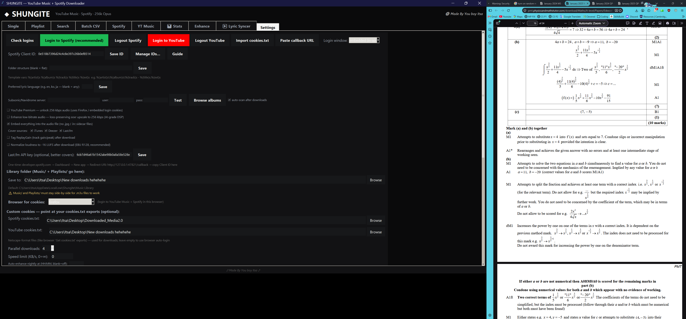

<div align="center">

# ◆ SHUNGITE

**YouTube Music + Spotify Downloader & Library Builder**

*Every song you've ever streamed — every playlist, every mix, your entire
Spotify history — downloaded from YouTube as best-quality Opus, named
`Artist - Title`, with cover art, synced lyrics, real genres, and the source
link written into the file itself.*


**⬇ [Download the installer from Releases](https://github.com/IrtezaAsif/Shungite/releases)**
— setup wizard · desktop shortcut · uninstaller · zero console windows

💬 **[Join the Discord](https://discord.gg/whczzt5VS7)** — support, bug reports, feature requests, showcase

</div>

---



---

## Table of contents

1. [What SHUNGITE actually does](#what-shungite-actually-does)
2. [Installation](#installation)
3. [The big picture — how every piece is correlated](#the-big-picture--how-every-piece-is-correlated)
4. [Every tab, in depth](#every-tab-in-depth)
   * [Single](#-single) · [Playlist](#-playlist) · [Search](#-search)
   * [Batch CSV (incl. full Spotify history import)](#-batch-csv--including-your-entire-spotify-history)
   * [Spotify (incl. YT Music playlist transfer)](#-spotify--including-the-youtube-music-playlist-transfer)
   * [YT Music (incl. Spotify playlist transfer)](#-yt-music--including-the-spotify-playlist-transfer)
   * [Stats](#-stats) · [Lyric Syncer](#-lyric-syncer) · [Settings](#%EF%B8%8F-settings)
5. [The matching engine — five stages, in detail](#the-matching-engine--five-stages-in-detail)
6. [The enrichment pipeline — what gets embedded and how](#the-enrichment-pipeline--what-gets-embedded-and-how)
7. [The download engine — resilience, layer by layer](#the-download-engine--resilience-layer-by-layer)
8. [Audio formats](#audio-formats)
9. [Where your data lives](#where-your-data-lives)
10. [Command line](#command-line)
11. [Build from source + installer + CI](#build-from-source--installer--ci)
12. [Project layout — every file](#project-layout--every-file)
13. [Troubleshooting & diagnostics](#troubleshooting--diagnostics)
14. [License](#license)

---

## What SHUNGITE actually does

You give it songs — as a pasted link, a playlist, a CSV of six thousand
rows, your Spotify login, or your full GDPR account export. SHUNGITE then,
for every single song:

1. **Searches YouTube** through three different backends (InnerTube,
   cookie-authenticated ytsearch, ytmusicsearch).
2. **Picks the right upload** — the most-viewed *correct* one: the official
   release, never a cover, slowed-down edit, nightcore, lyric-video
   reupload, live cut, or Dolby-binaural re-post.
3. **Downloads its best audio** as real Opus (or M4A), stream-copied with
   no lossy re-encode whenever possible.
4. **Enriches the file, inside its own tags**: cover art, *timed synced
   lyrics in the original language*, real genre, the exact YouTube link,
   and clean title/artist metadata.
5. **Cleans up after itself** — no sidecar files, no console windows, no
   half-downloaded junk.

And it does all of that through **one shared pipeline**, so a download from
any tab behaves exactly like a download from any other tab. That's the core
design decision in the codebase: one `_match_track()` for matching, one
`download_one()` for downloading, one `_post_download_fixups()` for
enrichment — every tab is a different *front door* to the same machine.

---

## Installation

### Option A — the installer (recommended)

Download **`Shungite_Setup_v1.0.0.exe`** from
[Releases](https://github.com/IrtezaAsif/Shungite/releases) and run it.
You get the full Windows experience:

* a **setup wizard** — welcome → license agreement → install location →
  additional-tasks page (desktop shortcut) → progress → finish;
* a **Start-menu group** and optional desktop shortcut;
* a proper **uninstaller** (Add/Remove Programs, leaves your music and
  settings alone).

### Option B — portable

Download `Shungite_win64.zip`, extract anywhere, run `Shungite.exe`. No
install, no admin rights, no registry writes.

### First run — the setup wizard



The first launch walks you through three steps: **welcome** (what the app
does), **pick your Music Library folder** (where `Music/` and `Playlists/`
are created), and the optional **embedded YouTube login** (strongly
recommended — a logged-in session is what keeps YouTube's bot walls away
from bulk downloads). After that it never appears again.

All app data lives in `%USERPROFILE%\AppData\LocalLow\Shungite` — config,
cookies, login state, debug logs. Nothing in Program Files, nothing in the
registry. Legacy `~/.peak_*` files from old versions are migrated
automatically on first touch.

> **Do the YouTube login inside the app** (Settings → YouTube login). It
> opens an embedded WebView2 window — your default browser never pops
> open — and the harvested session is reused by every download, search,
> and playlist transfer.

---

## The big picture — how every piece is correlated

This is the part most tools don't tell you. SHUNGITE's components aren't
independent features — they're stages of one chain, and each stage feeds
the next:

```
              ┌─────────────────────────────────────────────────┐
              │              SONG REQUEST                       │
              │  (URL · playlist · CSV row · Spotify login ·     │
              │   GDPR history · YT Music library · search)      │
              └───────────────────────┬─────────────────────────┘
                                      ▼
        ┌───────────────────────────────────────────────────┐
        │  innertube.py  → InnerTube search (YT Music API)  │
        │  search_youtube() → ytsearch + ytmusicsearch      │
        │  (all cookie-authenticated via the harvested jar) │
        └───────────────────────┬───────────────────────────┘
                                ▼
        ┌───────────────────────────────────────────────────┐
        │  matchers.py — strict_match()                      │
        │  hard DQ gates → duration window → fusion scoring  │
        │  → official-channel bonuses → CJK bridge          │
        │  → "official audio" rescue re-search               │
        └───────────────────────┬───────────────────────────┘
                                ▼
        ┌───────────────────────────────────────────────────┐
        │  download_one() — yt-dlp engine                    │
        │  remote_components JS-challenge solver · TV-client │
        │  bot-check fallback · cookie policy · format       │
        │  demotion · paced retries · cancel support         │
        └───────────────────────┬───────────────────────────┘
                                ▼
        ┌───────────────────────────────────────────────────┐
        │  _post_download_fixups() — enrichment             │
        │  YouTube timed captions → .lrc → embedded lyrics  │
        │  LRClib fallback (duration- & language-keyed)      │
        │  cover art (thumbnail → iTunes/last.fm/Deezer)    │
        │  genre (iTunes) · purl (source link) · clean tags │
        │  sidecar cleanup (glob.escape-safe)               │
        └───────────────────────┬───────────────────────────┘
                                ▼
              Artist - Title.opus   (+ .m3u per playlist,
                                    indexable, resumable)
```

The correlations that make this work end to end:

* **The matcher needs the search, the search needs the cookies.** Every
  search backend attaches the harvested YouTube login cookies — without
  them YouTube serves empty results on many networks. One login in
  Settings powers *everything*: searches, downloads, YT Music transfers.
* **Enrichment is keyed to the matched video, not the song.** Timed lyrics
  come from the *exact* video that was downloaded (its `purl` is embedded
  precisely so lyrics/cover always match the audio you actually have).
* **Durations flow from Spotify → matcher.** When a CSV row or Spotify
  track carries its real duration, the matcher's window tightens to ±25%
  around it — that's what kills live versions and radio edits.
* **Lyrics are language-aware from the title.** Japanese/Korean/Cyrillic
  titles select original-language captions — your Ado songs get Japanese
  lyrics, not machine-translated English.
* **The index makes everything resumable.** Every successful download is
  recorded in `_index.txt`; Batch CSV's *Sync Missing Only*, Spotify's
  *SYNC MISSING + M3U*, and the retry buttons all read the same index —
  nothing is ever downloaded twice.
* **Playlists end in real files.** A downloaded playlist produces the
  audio in flat `Music/` plus a `.m3u` in `Playlists/` built from the same
  index — so the m3u only references files that actually exist.

---

## Every tab, in depth

### 🎵 Single



The quick path: paste any YouTube or YT Music URL (or a plain search query)
and hit the red **Download**. *Auto-download on paste* starts it the instant
you paste. A URL skips matching entirely; a search query runs the full
five-stage matcher below. Quality picker offers exactly two formats —
**Best Opus** (default, stream-copied `.opus`) and **Best M4A** (AAC stream
copy into `.m4a`). Enrichment runs automatically the moment the download
lands — cover, timed lyrics, genre, source link, tags, cleanup.

### 📃 Playlist



Paste a YouTube playlist URL. SHUNGITE resolves every entry, then runs each
one through the identical match → download → embed chain — the same worker
pool, the same per-track log lines, the same Cancel (which terminates
in-flight ffmpeg process trees, not just the queue). Already-have detection
runs first so a re-run of the same playlist only fetches what's missing.

### 🔎 Search



Interactive search: type a query, get the same scored results the matcher
sees, click one to download it — or switch to *search my library* to find
what you already have. Useful for eyeballing what the matcher would pick
before committing a big batch.

### 📊 Batch CSV — including your entire Spotify history


The bulk engine. Point it at a folder of CSVs and it fills your library
resumably, in parallel, with per-track logging.

**Input formats** — every `.csv` in the folder is parsed
(`_read_batch_csvs`, pandas, UTF-8-BOM tolerant). Two column layouts are
understood: the **Exportify** format and the GDPR-export format the app
writes itself — `Track Name`, `Artist Name(s)`, `Duration (ms)`. Each file
becomes one "playlist" named after the file.

**The five buttons:**

* **Start Batch (Full)** — parse every CSV, deduplicate against the
  existing library (via the index + normalized filename matching), then
  download everything missing with N parallel workers (default 6). Progress
  shows as `[i/total] ✓new ↷skipped ✗failed`, and the activity log prints a
  full line per track — exactly the Spotify-tab style.
* **Sync Missing Only** — the resumable path: same engine, but it stops
  after confirming the library already covers the CSVs; only true gaps get
  downloaded. Safe to run as often as you like.
* **Generate M3U Only** — build one `.m3u` per CSV from the current index
  without downloading anything. Great for wiring playlists into a player
  before committing to downloads.
* **📦 Import Spotify data.zip** — *the headline feature*. Request your
  account data from Spotify (web → Settings → Privacy → *Download your
  data*; takes Spotify a few days to email it). Then drop the resulting zip
  in here: SHUNGITE reads **every `Streaming_History_Audio*.json` inside —
  every single track you have ever streamed since your account existed** —
  deduplicates it into a unique (track, artist) list, looks up each song's
  real duration from the iTunes Search API, and writes
  `Spotify_history_all.csv` — a ready-to-run batch. Your **complete
  listening history becomes a downloadable library**, not just saved
  playlists. (The CSV also uses the exact `Artist - Title` naming your files
  get, so players like Namida recognize everything.)
* **Retry failed** — re-runs only the tracks recorded in
  `failed_downloads.txt`, which logs *why* each failure failed, including
  the actual search results it saw at the time.

**Failure transparency** — every miss writes a reason to
`failed_downloads.txt`: `(no match; hits=8 sample=[…])` means the matcher
saw 8 results and rejected all; `(all 6 candidates failed)` means every
candidate was tried and download-verified; `(search error: …)` carries the
raw exception. You never have to guess.

### 🟢 Spotify — including the YouTube Music playlist transfer



Log in through the **embedded PKCE OAuth window** (a shared community
client ID is built in — zero setup). The tab then auto-detects your login
and loads a tree of everything in your account:

* your playlists (any count — select one, or **☑ SELECT ALL** for 100+ at
  once),
* **Made For You content** — Daily Mixes, daylist, Discovery/Release Radar
  and friends — pulled through the same GQL route the Spotify web client
  uses (`spotify_api.py`), no official API keys required,
* liked songs and albums.

The action row is where the correlation design pays off:

* **⬇ DOWNLOAD FULL PLAYLIST** — for every selected playlist: fetch its
  tracklist (`_sp_api_tracks`), skip what the index says you have, match
  each remaining track, download, enrich, and write one `.m3u` per
  playlist. Per-track log lines in the same style as every other tab.
* **🔄 SYNC MISSING + M3U** — the gentle version: index check first,
  only gaps downloaded.
* **☑ Merge mode** (checkbox under the folder row) — tick this with several
  playlists selected and the tracklists are **merged and
  cross-deduplicated into one combined batch**, so songs shared between
  playlists download exactly once.
* **📝 M3U ONLY** — playlists as files, no downloads.
* **→ YT Music (transfer)** — *a real playlist transfer, like TuneMyMusic
  but local.* For each selected Spotify playlist SHUNGITE:
  1. **creates a real playlist on music.youtube.com** via the InnerTube
     API (using your logged-in YT Music session — you must be signed in
     inside the app);
  2. fetches the Spotify tracklist;
  3. for every track, searches YT Music and picks the **best
     duration-matched upload** (the same `pick_best` scoring used for
     downloads — most-viewed, duration-checked, junk-filtered — *not*
     simply the first hit);
  4. **adds that video to the YouTube playlist** through the
     authenticated InnerTube API.
  No downloads happen and no `.m3u` is written — the result is a genuine
  playlist sitting in your YT Music library, ready for any device where
  you use YT Music. Progress is logged per track, and it stops cleanly if
  you hit Cancel.

  *Why it needs the YouTube login:* the transfer writes to your YT Music
  account, so it requires the authenticated cookies (`SAPISID` /
  `__Secure-1PSID`) that the embedded login stores. Spotify-side it only
  needs to *read* your playlists, which the cookie/GQL client already has.

* **Rate-limit resilience** — if the official Spotify API starts
  429-throttling, the tab transparently falls back to the cookie/GQL client
  and keeps going; a fetch failure skips the playlist (and says so)
  rather than killing the run.

### 🎧 YT Music — including the Spotify playlist transfer



The mirror image of the Spotify tab, for your YouTube Music account (same
embedded login):

* browse and select your YTM playlists, uploads, and liked songs;
* **download** them through the identical match → download → embed chain
  (InnerTube makes the tracklists instant);
* **→ Spotify (transfer)** — the reverse transfer: reads the selected YTM
  playlist's tracks, **searches Spotify for each track's URI**, then
  **creates a real Spotify playlist** via OAuth and adds the matched
  tracks. Same principle as the Spotify→YTM transfer: real playlists in
  the destination service, no downloads, per-track log.

So the two transfer buttons together give you **two-way playlist
migration** between Spotify and YouTube Music, entirely on your own
machine.

### 📈 Stats



Reads the SQLite history (`history_db.py`) and the library index to show
what you have and what happened: counts and sizes, top artists, download
success/failure tallies, and the failure report — the same data
`failed_downloads.txt` accumulates, but queryable.

### 🎤 Lyric Syncer



The third layer of the lyrics system, exposed as its own tool. Some songs
have no captions and no LRClib entry — for those, SHUNGITE runs
**WhisperX forced alignment on your NVIDIA GPU** (CUDA auto-detected,
float16):

* the *known* lyric text (from the file's tags or a fetched plain lyric)
  is split into phrases,
* WhisperX aligns each phrase against the **actual audio**, phrase by
  phrase, in bounded sequential windows — monotonic by construction, so
  lines can't scramble or bunch up,
* the result is a genuinely timed `.lrc`, embedded into the tags.

Per-file progress, a working cancel, everything on the GPU, everything in
the background — no console windows ever.

### ⚙️ Settings



The control room: **YouTube login** (embedded WebView2, cookies stored in
app data — re-harvested automatically), **Spotify login**, cookie source
(harvested jar / browser extraction / manual cookies.txt — with a
self-healing check that clears a bad path so it can never poison
downloads), default quality, format defaults per tab, Subsonic/Navidrome
server push, last.fm scrobbling key, the optional LAN **web remote**, and
the diagnostics pointers (`search_debug.log` location).

---

## The matching engine — five stages, in detail

One function — `_match_track()` in `PEAK_GITHUB_true.py`, scoring in
`matchers.py` — serves every tab. It finds the **most-viewed correct
upload** like this:

1. **Search, with fallback order.** InnerTube (`innertube.py`) queries the
   YouTube Music search API — fast, real artist names, durations. If
   InnerTube comes back empty, a **cookie-authenticated ytsearch** runs
   (flat extraction, 8 results), and if that's bot-walled empty, a
   **ytmusicsearch** pass is the last resort. All three attach the
   harvested login cookies.

2. **Hard gates — instant disqualification, never a soft penalty.** A
   candidate whose title contains any of these words (unless your query
   itself contains the word) can never be picked:
   `slowed`, `sped up`, `nightcore`, `8d`, `karaoke`, `reverb`, `mashup`,
   `fan made`, `amv`, `cover`, `cover version`, `remix` (unrequested),
   `reaction`, `tribute`, `snippet`, `teaser`, `live` / `live at` /
   `live from`, `THE FIRST TAKE`, `full english` / `english ver`, `dolby`,
   `binaural`, `extended`, `lyrics` / `lirik` / `terjemahan` (lyric-video
   channels), `romaji`, `sub español`… This is why "Mystery of Love"
   stops landing on *Sammy B (slowed down)* and why an anime OP stops
   landing on a YouTuber's English cover.

3. **Duration window.** Default sanity band is 40–720 s (kills "1 hour
   mix" uploads). **When the CSV or Spotify metadata provides the true
   duration, the band tightens to ±25% around it** — a 249 s song won't
   accept a 141 s live cut or a 300 s extended edit. Candidates with
   *unknown* duration are only trusted from official channels.

4. **Fusion scoring.** For what survives: fuzzy title/artist similarity +
   the search engine's own rank + **log-scaled view count** (the official
   250M-view upload beats the 900-view reupload even when both rank #1 in
   text similarity), plus strong bonuses for **official channels** —
   YT Music's auto-generated `Song`/`Topic` channels (the single most
   reliable "this is the original upload" signal) and any channel whose
   name *is* the artist. Ultra-short titles (like "0") get an extra rule:
   the artist must appear in channel or title at all.

5. **Rescue queries.** If the best survivor is still unofficial or has no
   duration, the search is retried with **"… official audio"** appended —
   and titles that poison searches (feat-lists, `(From 'X')`, remix
   parentheticals) are simplified and retried. **A CJK bridge** handles
   Japanese/Korean/Chinese by character overlap, so *Renai Circulation*
   finds 恋愛サーキュレーション's official upload and Ado's うっせぇわ
   never gets replaced by an English translation.

The net effect: **you get the upload the artist actually published** —
which has the real cover, the real audio, and (crucially for the next
section) the real timed captions.

---

## The enrichment pipeline — what gets embedded and how

`_post_download_fixups()` runs for **every** download from **every** tab,
synchronously in the worker, so a "done" file is always a finished file:

| What | How it works |
|---|---|
| **Cover art** | The matched video's own thumbnail is re-encoded and embedded as a proper front-cover tag. If it's missing or a gray placeholder, artwork is fetched from iTunes → Last.fm → Deezer (`titanium_enrich.py`). |
| **Synced lyrics** | Three correlated layers. ① **YouTube's own timed captions for that exact video** — original language preferred (detected from the title's script; JP songs get Japanese) — converted from VTT to `.lrc`. ② **LRClib**, keyed by real duration *and* preferred language, exact-match first. ③ **WhisperX alignment** (the Lyric Syncer) for everything else. The result is embedded in the lyrics tag so any player shows timed lyrics. |
| **Genre** | Per-track lookup against the iTunes Search API, cached per artist — so one artist lookup covers their whole catalog. |
| **Source link** | The exact YouTube URL in the `purl` tag — every file knows precisely which video it came from, which is also what makes lyrics/cover re-runs idempotent. |
| **True tags** | Title/artist always from the *song's* metadata (Spotify/CSV), never the video's title — "Mystery of Love" is never filed as "mystery of love (slowed)". |
| **Cleanup** | `.vtt`, `.jpg`, `.webp`, `.info.json`, `.segments.json` sidecars are deleted after embedding — with `glob.escape`, so bracketed names like `[English Ver]` can't dodge the glob. Your Music folder stays pure `.opus` + `.m3u`. |

---

## The download engine — resilience, layer by layer

`download_one()` wraps yt-dlp with a recovery chain built from every failure
mode seen in the wild:

* **JS-challenge solver (`remote_components: ["ejs:github"]`)** — YouTube
  requires solving a JavaScript challenge before serving player responses;
  yt-dlp's solver script is fetched from GitHub on first use. This is
  **the fresh-install fix**: without it, every download dies with
  *"The page needs to be reloaded."* Enabled by default in every build.
* **Bot-check fallback → TV client.** When a bot wall hits, the engine
  switches to the **TV player client**, which serves full audio formats
  without a PO token (the old embedded-client fallback got format-less
  responses), and paces retries so bulk jobs stay under the radar.
* **Cookie policy.** Searches and downloads always attach the harvested
  login cookies from app data — a logged-in session for bulk runs without
  ever lifting your live Firefox profile.
* **Format demotion.** Premium format IDs (774/141) auto-demote to
  `bestaudio/best` instead of failing the track.
* **Anonymous `web_embedded` never used for music** — embedded players
  receive no audio formats; the engine goes to TV instead.
* **6 parallel workers** by default with a working Cancel that kills
  in-flight ffmpeg process trees.
* **No consoles anywhere.** The exe is a GUI-subsystem binary and every
  child process (ffmpeg, deno, WhisperX) inherits `CREATE_NO_WINDOW`.
  The only window on your screen is the app itself.
* **Self-diagnosis.** Every search, matcher decision, and download failure
  is logged with its real reason to
  `%USERPROFILE%\AppData\LocalLow\Shungite\search_debug.log` — and at
  startup the app runs a **self-test download** writing `SELFTEST ok` to
  that log, so a broken environment is visible in seconds, not hours.

---

## Audio formats

Exactly two, on purpose:

* **Best Opus** (default) — `bestaudio[acodec=opus]`, stream-copied into
  `.opus`. When your logged-in account has Premium the hidden high
  formats (774/141) are tried first and demote automatically if absent.
  No lossy re-encode, ever, unless a target bitrate is configured.
* **Best M4A** — `bestaudio[acodec=aac]`, copied into `.m4a`.

(Video format remains available on the Single/Playlist tabs for the rare
music video.)

---

## Where your data lives

| What | Where |
|---|---|
| Config, cookies, login state, debug log | `%USERPROFILE%\AppData\LocalLow\Shungite` |
| Downloads | `<your Music Library>\Music` as `Artist - Title.opus` |
| Playlists | `<your Music Library>\Playlists` as one `.m3u` per playlist |
| Library index (resumability) | `Music\_index.txt` |
| Failure report | `<CSV folder>\failed_downloads.txt` |

---

## Command line

```
Shungite.exe --tab=batch
```

Open directly on any tab — names: `single playlist search batch spotify
ytm stats enhance lyric settings`, or an index 0–9. Useful for shortcuts
and automation.

---

## Build from source + installer + CI

```bat
git clone https://github.com/IrtezaAsif/Shungite.git
cd Shungite
py -3.12 -m venv venv
venv\Scripts\pip install -r requirements.txt
venv\Scripts\python PEAK_GITHUB_true.py
```

Requirements: **Python 3.12**, WebView2 Runtime (preinstalled on Windows
11). ffmpeg and deno are bundled by the build spec. A CUDA GPU makes the
Lyric Syncer ~10× faster.

### The exe

```bat
venv\Scripts\pip install pyinstaller
:: CRITICAL: clean environment — a stray PYTHONPATH poisons the build
:: with the wrong numpy and the exe crashes at startup
venv\Scripts\python -m PyInstaller PEAK_GITHUB_true.spec --noconfirm --clean ^
    --distpath dist3 --workpath build3\b
```

The spec bundles ffmpeg + ffprobe + deno, forces the GUI subsystem
(`console=False` → no console can ever appear), embeds the version
resource (`version_info.txt`, 1.0.0.0) and the app icon, and outputs
`dist3\Shungite\`.

### The installer

`installer\Shungite.iss` (Inno Setup) compiles to
`dist\Shungite_Setup_v1.0.0.exe` — the full wizard: welcome, license
(MIT), destination, additional tasks (desktop shortcut), progress,
finish-page launch option, plus Start-menu entries and a complete
uninstaller. Data in LocalLow is deliberately never touched by the
uninstaller — your music is yours.

### CI

`.github/workflows/build-installer.yml` — on every `v*` tag push (or
manual dispatch) a Windows runner installs dependencies, downloads ffmpeg,
builds the exe, installs Inno Setup, compiles the installer, and attaches
it to a GitHub Release automatically.

---

## Project layout — every file

| File | What it is |
|---|---|
| `PEAK_GITHUB_true.py` | The entire app: all 10 tabs, `_match_track()` pipeline, `download_one()` engine, `_post_download_fixups()` enrichment guarantee, playlist transfers (both directions), Spotify data.zip import, batch engine, wizard, LocalLow data dir, `--tab=` deep link, startup self-test |
| `matchers.py` | `strict_match()` — hard DQ gates, duration bands, popularity fusion, official-channel bonuses, CJK bridge |
| `titanium_enrich.py` | Enrichment: covers (thumbnail → iTunes/last.fm/Deezer), language-aware `fetch_lyrics()` (LRClib), `vtt_to_lrc()`, genre lookup, tag embedding, sidecar cleanup |
| `spotify_api.py` | Cookie/GQL Spotify client — playlists, Made-For-You sections, tracklists; works without official API keys |
| `spotify_oauth.py` | PKCE OAuth login + token refresh, playlist creation/paging for the YTM→Spotify transfer, artist genres |
| `innertube.py` | YouTube InnerTube client: music search **and** authenticated playlist creation/addition for the Spotify→YTM transfer |
| `login_window.py` | Embedded WebView2 YouTube login window |
| `browser_cookies.py` | Cookie extraction from installed browsers + the harvested-jar helpers |
| `download_queue.py` | Job queue with cancel events |
| `history_db.py` | SQLite download history (feeds Stats) |
| `musicbrainz.py` | MusicBrainz release/tracklist lookups |
| `sponsorblock.py` | SponsorBlock chapter marking via yt-dlp |
| `smart_playlists.py` | Auto-playlist generation (top-listened, recent…) |
| `acoustic_dedup.py` | Acoustic fingerprinting to detect duplicate downloads |
| `subsonic_push.py` | Push finished library to a Subsonic/Navidrome server |
| `web_remote.py` | Tiny LAN web remote for controlling downloads |
| `audit.py` | 20-check self-test suite |
| `PEAK_GITHUB_true.spec` | PyInstaller spec (ffmpeg + deno bundled, GUI subsystem, icon, version) |
| `installer/Shungite.iss` | Inno Setup installer script |
| `installer/shungite.ico` | App icon (all sizes 16→256) |
| `.github/workflows/build-installer.yml` | CI: build + installer + release asset on tags |
| `version_info.txt` | Windows version resource |
| `requirements.txt` | Python dependencies (runtime + build split) |

---

## Troubleshooting & diagnostics

* **Downloads say "Requested format is not available"** — demotion handles
  it automatically; ensure the YouTube login is done.
* **"The page needs to be reloaded" on a fresh install** — fixed in this
  build via the remote JS-challenge solver. Re-download the release if
  you have an older one.
* **Anything failing, ever** — open
  `%USERPROFILE%\AppData\LocalLow\Shungite\search_debug.log`. Every
  search (`search q=… cookiefile=True mode=…`), every matcher verdict,
  and every download failure (`DL FAIL … err=…`) is written there with
  the real error. A `SELFTEST ok` line at startup confirms the whole
  chain works on your machine.
* **Lyric Syncer wants a whisperX venv** — `pip install whisperx
  "numpy<2"` with a CUDA-matched torch, or run from source.
* **Spotify 403/429** — the cookie/GQL client takes over automatically;
  downloads continue.
* **Playlist transfer says "Log into YouTube Music first"** — do the
  YouTube login inside the app; the transfer needs the authenticated YT
  Music cookies.

---

## License

MIT — see [LICENSE](LICENSE). Downloaded content is for personal use;
respect YouTube's Terms of Service and copyright law.

---

<div align="center">

*SHUNGITE — made by Irteza* ◆

</div>
